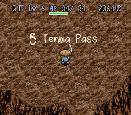
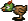
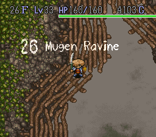

<!-- 

  

 -->

> That Golden City sleeps at the top of Table Mountain. Hearing rumors of the "Land of the Sun" on the
> wind, many Wanderers have sought its peak. However, all have failed.

## Overview

Table Mountain, also known as Kobami Valley (こばみ谷) is the main dungeon of Shiren the Wanderer.

<table class="dungeonOverview">
  <tr>
    <th>Entrance</th>
    <td class="highlightYellow">Valley Inn (East exit)</td>
  </tr>
</table>

<table class="dungeonTable">
  <tr>
    <th>Floors</th>
    <td colspan="3">30F</td>
  </tr>
  <tr>
    <th>Bring Items</th>
    <td>Yes</td>
    <th>Allies</th>
    <td>Yes</td>
  </tr>
  <tr>
    <th>Bring Gitan</th>
    <td>Yes</td>
    <th>Bring Level Ups</th>
    <td>Yes</td>
  </tr>
  <tr>
    <th>Starting Item</th>
    <td colspan="3">Big Rice Ball</td>
  </tr>
  <tr>
    <th>Unidentified</th>
    <td colspan="3">Weapons, Shields, Armbands, Staves, Jars</td>
  </tr>
  <tr>
    <th>Shops</th>
    <td>Yes</td>
    <th>Monster Houses</th>
    <td>Yes</td>
  </tr>
  <tr>
    <th>Clear Icon</th>
    <td></td>
    <th>Reward</th>
    <td>None</td>
  </tr>
</table>

## Strategy

### Early Stage (1~7F)

## Floor Guide

### Old Cedar-lined Road (1-2F)

The enemies at the start only use direct attacks, but you might struggle if you get swarmed in the
starting room. Pick up items without spending too much time on these floors.

#### New Enemy types

 **Bean Bandit**  **Kid Tengu**, and
 **Mamul** do not have special abilities.

### Mountain Stream (3-4F)

Much like the earlier floors, most of the time you'll just be moving on. However, it is possible to
use the Monster Nigiri Beasts to setup a [Nigiri Factory](../guides/strategies.md). If you have items
you have no use for, or a pack of arrows you can put the useful items on the ground (be careful for traps!)
and let a Monster Nigiri Beast attack you and attempt to turn items in your inventory into a Large Rice
Ball.

You can do this with arrows, firing arrows towards a wall or on the ground and letting the Nigiri Monster
transform them one at a time.

While this can be a common strategy found elsewhere, I find it difficult to do in Table Mountain as you
often don't have a large inventory, a shield to protect you from being damaged, or arrows.

#### New Enemy types

 **Haboon** does not have special abilities, but has
higher attack than other enemies on this floor.

 **Bowya** shoots wooden arrows in a straight line at Shiren .
If it can't shoot at Shiren, it will walk closer. Move in a zig-zag pattern to approach it.

 **Monster Daikon** can throw Poison Herbs at
Shiren, dealing 5 Damage, and causing Shiren's action speed to be reduced.

 **Gamara** will not attack you, and instead will attempt
to steal Gitan. If Shiren does not have Gitan in his wallet, it will follow Shiren around. It will
be attracted by bags of Gitan on the ground. When killed, it will always drop Gitan.

 **Monster Nigiri Beast** will turn
an unequipped item in Shiren's inventory into a Big Rice ball.

### Bamboo Forest Village

### Tenma Pass (5-6F)

#### New Enemy types

 **Kimen-Musha** will revive as a  Ghost Musha several turns after it is defeated.

 **Ghost Musha** only have 4 HP, take only 1
Damage, and have a chance to teleport when attacked. It will attempt to seek out another monster for
it to possess causing the target monster to advance in level.

 **Peetan** run away when Shiren gets close and will
always drop a Rice ball.

 **Field Raider** will seek out items on the ground
and turn it into weeds.

### Summit Forest (7F)

#### New Enemy types

 **Skeleton Mage** will cast random spells
at Shiren. Spell list: Swift, Knockback, Swap, and Teleport.

It only drops a Skeleton Mage staff, which is more useful than it seems, especially in some of the
upcoming floors.

 **Minion of Death** move fast.

### Summit Town

### Neburi Mine (8-9F)

Now that we are inside: you will notice the hallway will reduce your vision to only what is next to
you. This also applies to enemies!

The difficultly will start to increase. If you farmed extra experience earlier, it will pay off. You
can farm for Gitan from Gamagucchi, items from Theftodo, and Skeleton Mage Staves from Skeleton
Mages.

There are some Advanced Techniques for farming arrows from Kid Tanks.

#### New Enemy types

 **Dark Owl** makes the current room dark. Shiren and
enemies will only be able to see the immediately around them. Doesn't move, but will attack Shiren
if in range.

 **Soldier Ant** wanders around the map and digs in the
walls to make tunnels. Will attack Shiren if in range.

 **Debuta** throws rocks that deal damage. Sees in the
dark, and in hallways. Rocks can be thrown through other enemies, and over walls.

 **Kid Tank** is an upgrade of Bowya. It can take take two
actions in a turn. Move twice, move and shoot. It cannot shoot Shiren if it is right next to him.
Somewhat dangerous to fight out in the open. If you lure them into a hallway, they are harmless.

 **Theftodo** is another enemy that does not attack and
will attempt to steal from Shiren. It will either steal an unequipped item from Shiren's inventory,
or an item off the ground. If it dies before it manages to steal an item, it is guaranteed to drop
an item from from a large item pool, otherwise it will drop the item it has stolen.

🐛: There is a bug in the Shiren Fan Translation where it will say that an Arrow was stolen,
regardless what was actually stolen. Perceptive players will be able to see the sprite of the item
that was stolen with the Todo as it is teleporting away, or can check their inventory for missing
items. Using the Name command may change this text string; renaming an unidentified staff to "BT,"
for example, sometimes causes the message to read "Stole Arrow:BT!"

### Two Jizo Valley

### Cliff Grotto (10-11F)

If you didn't get a chance to get some extra EXP earlier, this can be a good spot to slow down to
catch up in levels. Flame Priests can be dangerous if you do not have a really strong Shield, or
Skeleton Mage Staves. Be careful in hallways if you're swapping between your good Shield and Leather
Shield, otherwise you'll find you're stuck with the Leather Shield on you which will hurt.

#### New Enemy types

 **Healer Rabbit** is a support monster. It
will teleport next to an enemy that has been dealt damage to heal it. It has low HP and Attack, so
it dies quickly. It spawns at a low-rate for the rest of Table Mountain.

 **Pumkorepkin** is a flying-ghost type enemy
that can travel and see through walls. Despite always being able to see Shiren, it moves erratically
so will take its time reaching him. They can also attack Shiren while inside a wall, while Shiren
cannot retaliate.

 **Norojo** is the youngest of the Curse Girl family. She
has a chance to curse Shiren's equipped shield.

 **Flame Priest** does not have any special
abilities, however it has higher HP and attack than other enemies. It will burn up any items thrown
at it, making them ineffective, and if hit with an explosion, it will multiply.

Somewhat dangerous, but staves are effective against it. If you got a Skeleton Mage Staff earlier,
this is a good target if you are struggling against it.

 **Kigni Tribe** will prioritize attacking other
enemies in an attempt to level up and grow stronger before turning on Shiren.

### Mountain Spirit Cave (12-14F)

Old Man Tanks are dangerous because they can easily level up into much stronger versions.

#### New Enemy Types

 **Old Man Tank** has Slow action speed (takes 1
Action for every 2 Shiren actions), and has an explosive shot that hits in a 3x3 square around where
it detonates. The explosion deals 20 true damage (cannot be reduced by Shield Strength).

You can lure it into a hallway and use a hit-and-run strategy against it, or you can stand in a tile
that is an "L" position away from it (2 tiles vertically and 1 tile horizontally, or 2 tiles
horizontally and 1 tile vertically), similar to a Knight-move in chess, and wait for it to come to
you.

 **Gamagucchi** behave the same as Gamara, but will
drop more money when it dies.

### Crooked Boulder Valley

### Waterfall Marsh (15-16F)

It's recommended to get through Waterfall Marsh as quickly as possible. The enemy combination here
includes enemies that will reduce your level, reduce your strength, inflict status aliments on you,
and rust your equipment. The enemies that don't do this hit hard and are difficult to kill. Nothing
in here is worth the experience.

#### New Enemy Types

 **Wriggling Honey** has a chance to
reduce Shiren's level by one. When Shiren's level is reduced, his experience will be 1 away from the
level he was at previously.

 **Absorber Larva** have a chance to reduce
Shiren's Maximum Strength by one.

 **Dizzy Daikon** are an upgraded version of
Monster Daikon. It has longer range and throws confusion herbs. If Shiren is already confused, it
will throw poison herbs instead.

 **Gedoro** are slimes that will occasionally rust
Shiren's equipped swords and shields. They do not attack, and have a chance to multiply when they
take damage.

 **Saber Gators** can attack twice in a single turn.

 **Gyazar** has no special abilities, but has relatively
high HP and defense.

### Table Mountain (17-19F)

Now that you ran as fast as you could through the last two floors, you have a breather, until you
notice how much damage Minotaurs will crit for.

The stuff in here **hurts,** but you will be rewarded with a lot of EXP. Often, I find I stick
around Floors 17-19 until the wind blows, or as long as I have the food for it.

However, Minotaur and Master Chicken hurts a lot when you first get here, especially if you have a
bad shield (e.g. Minotaur can crit for ~80 damage if you're running
around with a Leather Shield).

You can also farm Fleeing Peetan, which always drop a Large Rice Ball, and Green Todo, which always
drop an item.

Until you're strong enough to fight them unaided, great spot to use some Scrolls, Staves, or Dragon
Herbs. If you have a Bigroom Scroll combined with a few Airslash Scrolls, you can clear out the
whole room for a ton of EXP and sit around for a long time.

#### New Enemy Types

 **Minotaur** has a 25% to crit, dealing double damage.
Their crit cannot miss, so when deciding your actions, you should assume that you will miss and they
will crit. Dangerous, but gives a lot of EXP.

 **Master Chicken** has high attack power. If it
falls below 16 HP, it will transform into a Chicken. Somewhat dangerous, but gives a lot of EXP,
even when demoted to a Chicken.

 **Chicken** does not attack, running away from you at
double speed. It does not spawn naturally.

 **Ether Devil** is an invisible flying ghost. It
moves similarly to a Pumkorepkin, but cannot travel or see through walls. This is the only invisible
enemy in the game; if you haven't revealed it with a Vision Herb, Light Scroll or Far-sight Bracer,
it will be identified as "Someone" in the message log. Reflects magic from staves.

 **Norojo's Big Sister** will curse Swords
and Shields.

 **Fleeing Peetan** is an upgraded Peetan. Will
always drop a Big Rice Ball.

 **Green Todo** is just like a Theftodo, it also has a
chance to multiply when damaged.

### Table Mountain (20-22F)

If you were able to get a bit of extra experience from the earlier floors, you'll find that the next
few floors are not too bad.

Super Gaze is extremely dangerous, and you can get unlucky Menbells summoning multiple Level 2
enemies for you to deal with.

If you have a Bufoo Staff, you can use it on a Karakuroid to get Meat. You can use this to
intentionally span a Pitfall trap on Floor 22, making you go down to the Underground River Town
again. You can do this multiple time to rest at the inn, or purchase items from the shop.

#### New Enemy Types

 **Flame Priest 2** Same as earlier. Shows
up on Floor 20.

If you got at least to about level 21 from earlier floors, you should not have an issue fighting
them.

 **Shoebell** can summon a single level-1 enemy (excluding
certain types).

 **Menbells** can summon a single level-2 enemy (excluding
certain types).

 **Super Gaze** Very
dangerous. Can hypnotize Shiren, causing him to take a random action. This will often use or waste a
valuable item. This can include: eating a Revival Herb, removing equipment and throwing at it an
enemy (destroying it), reading a Blank Scroll. This also wastes your turn, so it's not uncommon to
get stunlocked by hypnosis for several turns, especially if multiple Super Gazes have you
surrounded.

 **Karakuroid** have Swift movement, and can create
traps beneath their feet.

 **Chain Head** has no special abilities. These
have extra attack range and can attack around corners in future installments of the series, but not
in Shiren 1.

 **Flying Peetan** will teleport away from Shiren
every time he attempts to get close. It always drops an item from a large pool, including high-value
ones.

### Underground River Town

Between Floor 21 and 22.

### Table Mountain (23-25)

Super Gaze and Chrome Armor can ruin your inventory, and Polygons can rob you of all your food. The
enemies here aren't likely to kill you outright, but can easily ruin your run.

#### New Enemy Types

 **Fog Hermit** can cast a strange spell in a straight
line that can go through enemies and obstacles. The spell will disable Shiren's natural HP
regeneration for ~30 turns. The spell can stack, with multiple instances of the spell causing
Shiren's HP to decrease each turn.

 **Dancing Polygon** can perform a strange dance
that causes Shiren to lose 30% of his current satiation. When it is in a room with Shiren, it will
teleport to be in front of Shiren always. Extremely dangerous if you are lacking in food.

 **Chrome Armor** can disarm Shiren of his equipped
weapon or shield, sending it flying behind him about 10 tiles. If an enemy is behind Shiren, this
can cause the equipmentto hit the enemy, which destroys the item.

 **Pumkorepkin** is the same as the earlier
Pumkorepkin, but a level 2.

### Mugen Ravine (26F)

You're in the home stretch. If you happen to have saved Light Scrolls, you'll find the last few
floors are more bearable.

There are not many enemy types in the monster table for the Mugen Ravine. Unfortunately, that means
you'll have to deal with a lot of Deaths and Skeleton Archmages.

If you happen to have a Blank Scroll, Skeleton Archmages are always a good target for Genocide
Scroll, but be careful as your throw can miss. A single Skeleton Archmage can kill your run.

Death is dangerous because they always have vision of Shiren, and they get to move and attack twice
per turn. You can easily be surrounded after just a few turns. Dealing with them should be your
first priority. They can move through walls in the later floors, but not through the trees in the
Mugen Ravine.

#### New Enemy Types

 **Death** is a flying ghost-type enemy that has Swift
Action. It can move and attack twice. It can also travel and see through walls similar to
Pumkorepkin.

 **Skeleton Archmage** can cast
dangerous spells at a range, including Sleep, Level-Down, Rice Ball transformation, sealing. All of
their spells are dangerous. If they cast Sleep on you, you will usually die; there's nothing
stopping them from stunlocking you with it. They can only see one tile in front of them in the Mugen
Ravine because the floor is technically composed entirely of hallways, but in the open rooms on
floors 27 and 30, their spells have infinite range.

### The Three Trials (27-29F)

More danger. Archmages still show up on 27, and Deaths show up until 29. Unlike the previous floor,
it's very easy to get caught in a hallway with a Death hitting you. Skeleton Archmages are also much
more dangerous on Floor 27. While everything here gives a lot of experience, it's unlikely you'll
need it.

#### New Enemy Types

 **Dragon Head** will pass through Shiren if
there is an enemy behind it, surrounding him.

 **Madremlas** can charge into Shiren, knocking him
back and scattering some items in his inventory on the floor. They give an exceptional amount of
experience, but have a lot of HP and defense.

 **Debucho** are similar to Debuta. It throws further and
does more damage.

 **Dragons** have a fire breath attack that will fire in a
straight line towards Shiren. Straightforward and dangerous.

### Land of the Sun

#### Golden City

Read about the once prosperous city and their downfall due to the appearance of a monster on tablets
throughout the ruined city.

#### Foot of the Rainbow

### Waterfall Cave (30F)

 

Mashoku Bug is the Boss of Table Mountain. It doesn't have any special attacks and moves normally,
but it has a lot of HP and Attack. Even with a decent Shield, it can do ~100 damage a hit. Most
things that work against normal Monsters will work against Mashoku Bug, with Bufoo Staff being an
exception (I wonder what it tastes like...). While Decoy Staff does work, the Decoy status can be
canceled by a Skeleton Archmage.

Shiren will enter the room at a random spot; the Mashoku Bug will be at the top of the room next to
the exit. The room will also have 
Skeleton Archmages  Madremlas and rarely  Ether Devils in there as well.

## Monster Table

See [Monsters](/system/monsters) for more information

- S - Shop is possible
- H - Monster House is possible
- G - Gitan Vault is possible

Numbers in parentheses are spawn rates (#)/256. Spawn Rates: Low Medium High

<!-- <=25: Low, >=85 High  -->

<table class="monsterTable">
  <thead>
    <tr>
      <th>F</th>
      <th>S</th>
      <th>H</th>
      <th>G</th>
      <th colspan="5">Monsters</th>
    </tr>
  </thead>
  <tbody>
    <tr>
      <td class="">1</td>
      <td class=""></td>
      <td class=""></td>
      <td class=""></td>
      <td class="high"> Bean Bandit (85)</td>
      <td class="high"> Kid Tengu (86)</td>
      <td class="high">Mamul (85)</td>
      <td></td>
      <td></td>
    </tr>
    <tr>
      <td colspan="9" class="tableDivider"></td>
    </tr>
    <tr>
      <td class="">2</td>
      <td class=""></td>
      <td class=""></td>
      <td class=""></td>
      <td class="high"> Bean Bandit (85)</td>
      <td class="high"> Kid Tengu (86)</td>
      <td class="high">Mamul (85)</td>
      <td></td>
      <td></td>
    </tr>
    <tr>
      <td colspan="9" class="tableDivider"></td>
    </tr>
    <tr>
      <td rowspan="2" class="">3</td>
      <td rowspan="2" class=""></td>
      <td rowspan="2" class=""></td>
      <td rowspan="2" class=""></td>
      <td class="mid"> Bowya (59)</td>
      <td class="low"> Monster Nigiri Beast (14)</td>
      <td class="mid"> Bean Bandit (59)</td>
      <td class="mid"> Kid Tengu (58)</td>
      <td class="low"> Gamara (7)</td>
    </tr>
      <td class="mid">Ghost Radish (59)</td>
      <td></td>
      <td></td>
      <td></td>
      <td></td>
    <tr>
      <td colspan="9" class="tableDivider"></td>
    </tr>
    <tr>
      <td class="">4</td>
      <td class=""></td>
      <td class=""></td>
      <td class=""></td>
      <td class="mid"> Bowya (76)</td>
      <td class="low"> Monster Nigiri Beast (19)</td>
      <td class="mid"> Haboon (76)</td>
      <td class="low"> Gamara (9)</td>
      <td class="mid">Ghost Radish (76)</td>
    </tr>
    <tr>
      <td colspan="9" class="tableDivider"></td>
    </tr>
    <tr>
      <td class="monsterTableVillage"></td>
      <td colspan="3" class="monsterTableVillage"></td>
      <td colspan="5" class="monsterTableVillage">Bamboo Forest Village</td>
    </tr>
    <tr>
      <td colspan="9" class="tableDivider"></td>
    </tr>
    <tr>
      <td rowspan="2" class="">5</td>
      <td rowspan="2" class=""></td>
      <td rowspan="2" class=""></td>
      <td rowspan="2" class=""></td>
      <td class="mid"> Kimen-Musha (71)</td>
      <td class="low"> Peetan (17)</td>
      <td class="low"> Monster Nigiri Beast (18)</td>
      <td class="mid"> Haboon (71)</td>
      <td class="mid"> Field Raider (70)</td>
    </tr>
    <tr>
      <td class="low"> Gamara (9)</td>
      <td class=""></td>
      <td class=""></td>
      <td class=""></td>
      <td class=""></td>
    </tr>
    <tr>
      <td colspan="9" class="tableDivider"></td>
    </tr>
    <tr>
      <td rowspan="2" class="">6</td>
      <td rowspan="2" class=""></td>
      <td rowspan="2" class=""></td>
      <td rowspan="2" class=""></td>
      <td class="mid"> Kimen-Musha (71)</td>
      <td class="low"> Peetan (17)</td>
      <td class="low"> Monster Nigiri Beast (18)</td>
      <td class="mid"> Haboon (71)</td>
      <td class="mid"> Field Raider (70)</td>
    </tr>
    <tr>
      <td class="low"> Gamara (9)</td>
      <td class=""></td>
      <td class=""></td>
      <td class=""></td>
      <td class=""></td>
    </tr>
    <tr>
      <td colspan="9" class="tableDivider"></td>
    </tr>
    <tr>
      <td rowspan="2" class="">7</td>
      <td rowspan="2" class=""></td>
      <td rowspan="2" class=""></td>
      <td rowspan="2" class=""></td>
      <td class="mid"> Kimen-Musha (76)</td>
      <td class="low"> Peetan (19)</td>
      <td class="mid"> Skeleton Mage (76)</td>
      <td class="mid"> Minion of Death (76)</td>
      <td class="low"> Gamara (9)</td>
    </tr>
    <tr>
      <td colspan="9" class="tableDivider"></td>
    </tr>
    <tr>
      <td class="monsterTableVillage"></td>
      <td colspan="3" class="monsterTableVillage"></td>
      <td colspan="5" class="monsterTableVillage">Summit Town</td>
    </tr>
    <tr>
      <td colspan="9" class="tableDivider"></td>
    </tr>
    <tr>
      <td rowspan="2" class="">8</td>
      <td rowspan="2" class="highlightShop"></td>
      <td rowspan="2" class="highlightMH"></td>
      <td rowspan="2" class="highlightGitan"></td>
      <td class="low"> Dark Owl (7)</td>
      <td class="low"> Peetan (13)</td>
      <td class="mid"> Skeleton Mage (52)</td>
      <td class="low"> Soldier Ant (7)</td>
      <td class="mid"> Kid Tank (52)</td>
    </tr>
    <tr>
      <td class="mid"> Debuta (53)</td>
      <td class="mid"> Minion of Death (52)</td>
      <td class="low"> Gamagucchi (7)</td>
      <td class="low"> Theftodo (13)</td>
      <td class=""></td>
    </tr>
    <tr>
      <td colspan="9" class="tableDivider"></td>
    </tr>
    <tr>
      <td rowspan="2" class="">9</td>
      <td rowspan="2" class="highlightShop"></td>
      <td rowspan="2" class="highlightMH"></td>
      <td rowspan="2" class="highlightGitan"></td>
      <td class="low"> Dark Owl (7)</td>
      <td class="low"> Peetan (13)</td>
      <td class="mid"> Skeleton Mage (52)</td>
      <td class="low"> Soldier Ant (7)</td>
      <td class="mid"> Kid Tank (52)</td>
    </tr>
    <tr>
      <td class="mid"> Debuta (53)</td>
      <td class="mid"> Minion of Death (52)</td>
      <td class="low"> Gamagucchi (7)</td>
      <td class="low"> Theftodo (13)</td>
      <td class=""></td>
    </tr>
    <tr>
      <td colspan="9" class="tableDivider"></td>
    </tr>
    <tr>
      <td class="monsterTableVillage"></td>
      <td colspan="3" class="monsterTableVillage"></td>
      <td colspan="5" class="monsterTableVillage">Two Jizo Valley</td>
    </tr>
    <tr>
      <td colspan="9" class="tableDivider"></td>
    </tr>
    <tr>
      <td rowspan="3" class="">10</td>
      <td rowspan="3" class="highlightShop"></td>
      <td rowspan="3" class="highlightMH"></td>
      <td rowspan="3" class="highlightGitan"></td>
      <td class="low"> Healer Rabbit (5)</td>
      <td class="low"> Dark Owl (6)</td>
      <td class="low"> Peetan (10)</td>
      <td class="mid"> Pumkorepkin (43)</td>
      <td class="mid"> Norojo (43)</td>
    </tr>
    <tr>
      <td class="low"> Soldier Ant (5)</td>
      <td class="mid"> Kid Tank (43)</td>
      <td class="mid"> Debuta (42)</td>
      <td class="low"> Gamagucchi (6)</td>
      <td class="low"> Theftodo (10)</td>
    </tr>
    <tr>
      <td class="mid">Flame Priest (43)</td>
      <td class=""></td>
      <td class=""></td>
      <td class=""></td>
      <td class=""></td>
    </tr>
    <tr>
      <td colspan="9" class="tableDivider"></td>
    </tr>
    <tr>
      <td rowspan="2" class="">11</td>
      <td rowspan="3" class="highlightShop"></td>
      <td rowspan="3" class="highlightMH"></td>
      <td rowspan="3" class="highlightGitan"></td>
      <td class="low"> Healer Rabbit (8)</td>
      <td class="low"> Dark Owl (7)</td>
      <td class="low"> Peetan (15)</td>
      <td class="mid"> Pumkorepkin (60)</td>
      <td class="mid"> Norojo (61)</td>
    </tr>
    <tr>
      <td class="low"> Soldier Ant (7)</td>
      <td class="low"> Gamagucchi (8)</td>
      <td class="low"> Theftodo (15)</td>
      <td class="mid"> Flame Priest (60)</td>
      <td class="low"> Kigni Tribe (15)</td>
    </tr>
    </tr>
    <tr>
      <td colspan="9" class="tableDivider"></td>
    </tr>
    <tr>
      <td rowspan="3" class="">12</td>
      <td rowspan="3" class="highlightShop"></td>
      <td rowspan="3" class="highlightMH"></td>
      <td rowspan="3" class="highlightGitan"></td>
      <td class="low"> Healer Rabbit (6)</td>
      <td class="low"> Dark Owl (6)</td>
      <td class="low"> Peetan (12)</td>
      <td class="mid"> Pumkorepkin (49)</td>
      <td class="mid"> Old Man Tank (49)</td>
    </tr>
    <tr>
      <td class="mid"> Norojo (49)</td>
      <td class="low"> Soldier Ant (6)</td>
      <td class="low"> Gamagucchi (6)</td>
      <td class="low"> Theftodo (12)</td>
      <td class="mid"> Flame Priest (49)</td>
    </tr>
    <tr>
      <td class="low"> Kigni Tribe (12)</td>
      <td class=""></td>
      <td class=""></td>
      <td class=""></td>
      <td class=""></td>
    </tr>
    <tr>
      <td colspan="9" class="tableDivider"></td>
    </tr>
    <tr>
      <td rowspan="2" class="">13</td>
      <td rowspan="2" class="highlightShop"></td>
      <td rowspan="2" class="highlightMH"></td>
      <td rowspan="2" class="highlightGitan"></td>
      <td class="low"> Healer Rabbit (10)</td>
      <td class="low"> Dark Owl (10)</td>
      <td class="low"> Peetan (19)</td>
      <td class="mid"> Pumkorepkin (79)</td>
      <td class="mid"> Old Man Tank (79)</td>
    </tr>
    <tr>
      <td class="low"> Soldier Ant (10)</td>
      <td class="low"> Gamagucchi (10)</td>
      <td class="low"> Theftodo (19)</td>
      <td class="low"> Kigni Tribe (20)</td>
      <td class=""></td>
    </tr>
    <tr>
      <td colspan="9" class="tableDivider"></td>
    </tr>
    <tr>
      <td rowspan="2" class="">14</td>
      <td rowspan="2" class="highlightShop"></td>
      <td rowspan="2" class="highlightMH"></td>
      <td rowspan="2" class="highlightGitan"></td>
      <td class="low"> Healer Rabbit (16)</td>
      <td class="low"> Dark Owl (16)</td>
      <td class="mid"> Peetan (32)</td>
      <td class="high"> Old Man Tank (128)</td>
      <td class="low"> Soldier Ant (16)</td>
    </tr>
    <tr>
      <td class="low"> Gamagucchi (16)</td>
      <td class="low"> Theftodo (32)</td>
      <td class=""></td>
      <td class=""></td>
      <td class=""></td>
    </tr>
    <tr>
      <td colspan="9" class="tableDivider"></td>
    </tr>
    <tr>
      <td class="monsterTableVillage"></td>
      <td colspan="3" class="monsterTableVillage"></td>
      <td colspan="5" class="monsterTableVillage">Crooked Boulder Valley</td>
    </tr>
    <tr>
      <td colspan="9" class="tableDivider"></td>
    </tr>
    <tr>
      <td rowspan="2" class="">15</td>
      <td rowspan="2" class=""></td>
      <td rowspan="2" class=""></td>
      <td rowspan="2" class=""></td>
      <td class="low"> Healer Rabbit (8)</td>
      <td class="mid"> Saber Gator (25)</td>
      <td class="mid"> Gedoro (30)</td>
      <td class="mid"> Gyazar (42)</td>
      <td class="mid"> Dizzy Daikon (40)</td>
    </tr>
    <tr>
      <td class="mid"> Absorber Larva (35)</td>
      <td class="mid"> Wriggling Honey (36)</td>
      <td class=""></td>
      <td class=""></td>
      <td class=""></td>
    </tr>
    <tr>
      <td colspan="9" class="tableDivider"></td>
    </tr>
    <tr>
      <td rowspan="2" class="">16</td>
      <td rowspan="2" class=""></td>
      <td rowspan="2" class=""></td>
      <td rowspan="2" class=""></td>
      <td class="low"> Healer Rabbit (8)</td>
      <td class="mid"> Saber Gator (25)</td>
      <td class="mid"> Gedoro (30)</td>
      <td class="mid"> Gyazar (42)</td>
      <td class="mid"> Dizzy Daikon (40)</td>
    </tr>
    <tr>
      <td class="mid"> Absorber Larva (35)</td>
      <td class="mid"> Wriggling Honey (36)</td>
      <td class=""></td>
      <td class=""></td>
      <td class=""></td>
    </tr>
    <tr>
      <td colspan="9" class="tableDivider"></td>
    </tr>
    <tr>
      <td rowspan="2" class="">17</td>
      <td rowspan="2" class="highlightShop"></td>
      <td rowspan="2" class="highlightMH"></td>
      <td rowspan="2" class="highlightGitan"></td>
      <td class="high"> Minotaur (89)</td>
      <td class="low"> Healer Rabbit (11)</td>
      <td class="high"> Master Chicken (89)</td>
      <td class="low"> Fleeing Peetan (11)</td>
      <td class="low"> Norojo's Big Sister (23)</td>
    </tr>
    <tr>
      <td class="low"> Green Todo (22)</td>
      <td class="low"> Ether Devil (11)</td>
      <td class=""></td>
      <td class=""></td>
      <td class=""></td>
    </tr>
    <tr>
      <td colspan="9" class="tableDivider"></td>
    </tr>
    <tr>
      <td rowspan="2" class="">18</td>
      <td rowspan="2" class="highlightShop"></td>
      <td rowspan="2" class="highlightMH"></td>
      <td rowspan="2" class="highlightGitan"></td>
      <td class="high"> Minotaur (89)</td>
      <td class="low"> Healer Rabbit (11)</td>
      <td class="high"> Master Chicken (89)</td>
      <td class="low"> Fleeing Peetan (11)</td>
      <td class="low"> Norojo's Big Sister (23)</td>
    </tr>
    <tr>
      <td class="low"> Green Todo (22)</td>
      <td class="low"> Ether Devil (11)</td>
      <td class=""></td>
      <td class=""></td>
      <td class=""></td>
    </tr>
    <tr>
      <td colspan="9" class="tableDivider"></td>
    </tr>
    <tr>
      <td rowspan="2" class="">19</td>
      <td rowspan="2" class="highlightShop"></td>
      <td rowspan="2" class="highlightMH"></td>
      <td rowspan="2" class="highlightGitan"></td>
      <td class="high"> Minotaur (89)</td>
      <td class="low"> Healer Rabbit (11)</td>
      <td class="high"> Master Chicken (89)</td>
      <td class="low"> Fleeing Peetan (11)</td>
      <td class="low"> Norojo's Big Sister (23)</td>
    </tr>
    <tr>
      <td class="low"> Green Todo (22)</td>
      <td class="low"> Ether Devil (11)</td>
      <td class=""></td>
      <td class=""></td>
      <td class=""></td>
    </tr>
    <tr>
      <td colspan="9" class="tableDivider"></td>
    </tr>
    <tr>
      <td rowspan="2" class="">20</td>
      <td rowspan="2" class="highlightShop"></td>
      <td rowspan="2" class="highlightMH"></td>
      <td rowspan="2" class="highlightGitan"></td>
      <td class="mid"> Minotaur (68)</td>
      <td class="low"> Healer Rabbit (9)</td>
      <td class="mid"> Master Chicken (68)</td>
      <td class="low"> Flying Peetan (17)</td>
      <td class="low"> Green Todo (17)</td>
    </tr>
    <tr>
      <td class="low"> Ether Devil (9)</td>
      <td class="mid"> Flame Priest 2 (68)</td>
      <td class=""></td>
      <td class=""></td>
      <td class=""></td>
    </tr>
    <tr>
      <td colspan="9" class="tableDivider"></td>
    </tr>
    <tr>
      <td rowspan="2" class="">21</td>
      <td rowspan="2" class="highlightShop"></td>
      <td rowspan="2" class="highlightMH"></td>
      <td rowspan="2" class="highlightGitan"></td>
      <td class="low"> Healer Rabbit (6)</td>
      <td class="low"> Flying Peetan (12)</td>
      <td class="low"> Shoebell (12)</td>
      <td class="low"> Menbells (13)</td>
      <td class="mid"> Super Gaze (48)</td>
    </tr>
    <tr>
      <td class="mid"> Karakuroid (49)</td>
      <td class="low"> Green Todo (12)</td>
      <td class="low"> Ether Devil (6)</td>
      <td class="mid"> Flame Priest 2 (49)</td>
      <td class="mid"> Chain Head (49)</td>
    </tr>
    <tr>
      <td colspan="9" class="tableDivider"></td>
    </tr>
    <tr>
      <td class="monsterTableVillage"></td>
      <td colspan="3" class="monsterTableVillage"></td>
      <td colspan="5" class="monsterTableVillage">Stream Village</td>
    </tr>
    <tr>
      <td colspan="9" class="tableDivider"></td>
    </tr>
    <tr>
      <td rowspan="2" class="">22</td>
      <td rowspan="2" class="highlightShop"></td>
      <td rowspan="2" class="highlightMH"></td>
      <td rowspan="2" class="highlightGitan"></td>
      <td class="low"> Healer Rabbit (6)</td>
      <td class="low"> Flying Peetan (12)</td>
      <td class="low"> Shoebell (12)</td>
      <td class="low"> Menbells (13)</td>
      <td class="mid"> Super Gaze (48)</td>
    </tr>
    <tr>
      <td class="mid"> Karakuroid (49)</td>
      <td class="low"> Green Todo (12)</td>
      <td class="low"> Ether Devil (6)</td>
      <td class="mid"> Flame Priest 2 (49)</td>
      <td class="mid"> Chain Head (49)</td>
    </tr>
    <tr>
      <td colspan="9" class="tableDivider"></td>
    </tr>
    <tr>
      <td rowspan="3" class="">23</td>
      <td rowspan="3" class=""></td>
      <td rowspan="3" class="highlightMH"></td>
      <td rowspan="3" class=""></td>
      <td class="mid"> Fog Hermit (39)</td>
      <td class="low"> Healer Rabbit (5)</td>
      <td class="low"> Dark Owl (5)</td>
      <td class="low"> Flying Peetan (10)</td>
      <td class="low"> Shoebell (10)</td>
    </tr>
    <tr>
      <td class="low"> Menbells (10)</td>
      <td class="low"> Pumkorepkin (5)</td>
      <td class="mid"> Super Gaze (39)</td>
      <td class="low"> Dancing Polygon (10)</td>
      <td class="mid"> Karakuroid (39)</td>
    </tr>
    <tr>
      <td class="mid"> Chrome Armor (40)</td>
      <td class="low"> Ether Devil (5)</td>
      <td class="mid"> Chain Head (39)</td>
      <td class=""></td>
      <td class=""></td>
    </tr>
    <tr>
      <td colspan="9" class="tableDivider"></td>
    </tr>
    <tr>
      <td rowspan="3" class="">24</td>
      <td rowspan="3" class=""></td>
      <td rowspan="3" class="highlightMH"></td>
      <td rowspan="3" class=""></td>
      <td class="mid"> Fog Hermit (47)</td>
      <td class="low"> Healer Rabbit (5)</td>
      <td class="low"> Dark Owl (6)</td>
      <td class="low"> Flying Peetan (12)</td>
      <td class="low"> Shoebell (11)</td>
    </tr>
    <tr>
      <td class="low"> Menbells (12)</td>
      <td class="low"> Pumkorepkin (6)</td>
      <td class="mid"> Super Gaze (46)</td>
      <td class="low"> Dancing Polygon (12)</td>
      <td class="mid"> Chrome Armor (47)</td>
    </tr>
    <tr>
      <td class="low"> Ether Devil (5)</td>
      <td class="mid"> Chain Head (47)</td>
      <td class=""></td>
      <td class=""></td>
      <td class=""></td>
    </tr>
    <tr>
      <td colspan="9" class="tableDivider"></td>
    </tr>
    <tr>
      <td rowspan="2" class="">25</td>
      <td rowspan="2" class=""></td>
      <td rowspan="2" class="highlightMH"></td>
      <td rowspan="2" class=""></td>
      <td class="mid"> Fog Hermit (73)</td>
      <td class="low"> Healer Rabbit (9)</td>
      <td class="low"> Dark Owl (9)</td>
      <td class="low"> Flying Peetan (19)</td>
      <td class="low"> Shoebell (18)</td>
    </tr>
    <tr>
      <td class="low"> Menbells (18)</td>
      <td class="low"> Pumkorepkin (9)</td>
      <td class="low"> Dancing Polygon (19)</td>
      <td class="mid"> Chrome Armor (73)</td>
      <td class="low"> Ether Devil (9)</td>
    </tr>
    <tr>
      <td colspan="9" class="tableDivider"></td>
    </tr>
    <tr>
      <td class="">26</td>
      <td class=""></td>
      <td class=""></td>
      <td class=""></td>
      <td class="low"> Healer Rabbit (14)</td>
      <td class="high"> Skeleton Archmage (114)</td>
      <td class="high"> Death (114)</td>
      <td class="low"> Ether Devil (14)</td>
      <td class=""></td>
    </tr>
    <tr>
      <td colspan="9" class="tableDivider"></td>
    </tr>
    <tr>
      <td rowspan="2" class="">27</td>
      <td rowspan="2" class=""></td>
      <td rowspan="2" class="highlightMH"></td>
      <td rowspan="2" class=""></td>
      <td class="low"> Healer Rabbit (6)</td>
      <td class="mid"> Dragon Head (48)</td>
      <td class="mid"> Skeleton Archmage (48)</td>
      <td class="mid"> Madremlas (48)</td>
      <td class="mid"> Debucho (12)</td>
    </tr>
    <tr>
      <td class="mid"> Dragon (47)</td>
      <td class="mid"> Death (48)</td>
      <td class=""></td>
      <td class=""></td>
      <td class=""></td>
    </tr>
    <tr>
      <td colspan="9" class="tableDivider"></td>
    </tr>
    <tr>
      <td rowspan="2" class="">28</td>
      <td rowspan="2" class=""></td>
      <td rowspan="2" class="highlightMH"></td>
      <td rowspan="2" class=""></td>
      <td class="low"> Healer Rabbit (7)</td>
      <td class="mid"> Dragon Head (59)</td>
      <td class="mid"> Madremlas (58)</td>
      <td class="low"> Debucho (15)</td>
      <td class="mid"> Dragon (58)</td>
    </tr>
    <tr>
      <td class="mid"> Death (49)</td>
      <td class=""></td>
      <td class=""></td>
      <td class=""></td>
      <td class=""></td>
    </tr>
    <tr>
      <td colspan="9" class="tableDivider"></td>
    </tr>
    <tr>
      <td rowspan="2" class="">29</td>
      <td rowspan="2" class=""></td>
      <td rowspan="2" class="highlightMH"></td>
      <td rowspan="2" class=""></td>
      <td class="low"> Healer Rabbit (7)</td>
      <td class="mid"> Dragon Head (59)</td>
      <td class="mid"> Madremlas (58)</td>
      <td class="low"> Debucho (15)</td>
      <td class="mid"> Dragon (58)</td>
    </tr>
    <tr>
      <td class="mid"> Death (49)</td>
      <td class=""></td>
      <td class=""></td>
      <td class=""></td>
      <td class=""></td>
    </tr>
    <tr>
      <td colspan="9" class="tableDivider"></td>
    </tr>
    <tr>
      <td class="monsterTableVillage"></td>
      <td colspan="3" class="monsterTableVillage"></td>
      <td colspan="5" class="monsterTableVillage">Golden City / Rainbow's End</td>
    </tr>
    <tr>
      <td colspan="9" class="tableDivider"></td>
    </tr>
    <tr>
      <td rowspan="2" class="">30</td>
      <td rowspan="2"class=""></td>
      <td rowspan="2" class=""></td>
      <td rowspan="2" class=""></td>
      <td colspan="5" class="highlightDanger"> Mashoku
        Bug</td>
    </tr>
    <tr>
      <td class="high"> Skeleton Archmage (120) </td>
      <td class="high"> Madremlas (121)</td>
      <td class="low"> Ether Devil (15)</td>
      <td class=""></td>
      <td class=""></td>
    </tr>
    <tr>
      <td colspan="9" class="tableDivider"></td>
    </tr>
  </tbody>
</table>
