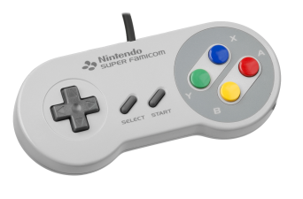
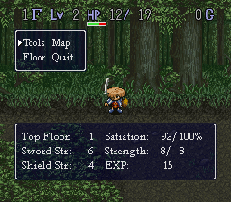

## Controls

- D-Pad: Movement
- A: Attack
- B: Run, Trade Places with NPC
- Y: Turn w/o moving, (sorts inventory while in menu)
- X: Menu
- L: Fire equipped Arrows
- R: Force diagonal movement
- Select: Show Map

## UI

- F: The Floor you are on
- Lv: Shiren's Level
- HP: Hit Points
- G: Gitan: currency
- Tools: Shiren's Inventory
- Map: Toggles the Map Overlay
- Floor: Shows the item or trap underneath Shiren
- Quit: Suspend the Game (on next load it will bring you back to the exact spot)
- Top Floor: The furthest you've gotten on this save file
- Satiation: Satiation is hunger/fullness. If your Satiation reaches 0% you stop regenerating HP and
  start taking damage per turn
- Sword Str.: The power of Shiren's Sword
- Strength: Shiren's Current / Max Strength
- Shield Str.: The power of Shiren's Shield
- EXP: Experience Points

Shiren's Level, Current Strength, and Sword Strength determines his damage, and his Shield Strength
determines the damage he receives from Monsters.

## Items

Shiren does not have any innate abilities, he can move, attack, and use [items](../items/). Other than
equipment, all items have limited usage - Shiren is a game about managing your items!

### Equipment

Straightforward: [Swords](../items/weapons) increase Attack. [Shields](../items/shields) increase Defense.
[Bracers](../items/bracers) give a passive effect. [Arrows](../items/arrows) can be fired with the L
button or from the menu. You can only have one of each equipped.
