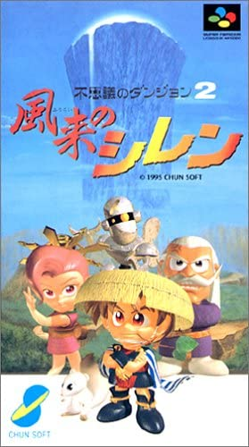
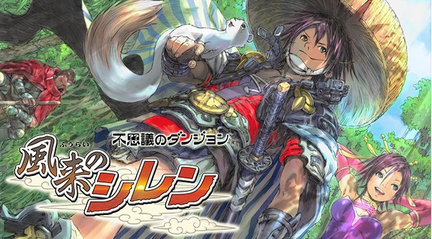

This is a wiki for "Mystery Dungeon 2: Shiren the Wanderer" for the Super Famicom,
maintained by Zoiteki. I wanted to make a well-documented guide specifically for
the SFC version because I think this game is something truly special.

While never released officially outside of Japan, there is a [English Translation
patch created by Aeon Genesis](https://www.romhacking.net/translations/483/). The
terminology used in this wiki will prefer to use the names and terms used in the
patch.

It should be noted there are significant changes between the SFC version of Shiren
the Wanderer and the DS/Mobile versions. The changes are so drastic, I find it difficult
to call the DS version a port. If you are looking for information regarding Mystery
Dungeon: Shiren the Wanderer for the Nintendo DS, you should look at <https://sharksnack.github.io/shiren-ds1/>
maintained by SharkSnack.

A large portion of the information gathered for this wiki is gathered from the Japanese
unofficial strategy wiki here: <https://seesaawiki.jp/shiren1/>. The template and
format of this guide I borrowed from [SharkSnack's](https://github.com/SharkSnack)
other Shiren the Wanderer wiki pages, which are all great.

<table>
  <tr>
    <th>Game Console</th>
    <td>Super Famicom</td>
    <td>Nintendo DS</td>
    <td>Mobile</td>
  </tr>
  <tr>
    <th>Release Date</th>
    <td>December 1, 1995 (JP)</td>
    <td>December 14, 2006 (JP) March 4, 2008 (NA)</td>
    <td>March 12, 2019 (JP)</td>
  </tr>
  <tr>
    <th>Official Site</th>
    <td>-</td>
    <td><a href="https://www.spike-chunsoft.co.jp/games/shiren_ds/">DS (Japanese)</a></td>
    <td><a href="https://www.spike-chunsoft.co.jp/shiren_sp/">Mobile (Japanese)</a></td>
  </tr>
  <tr>
    <th>Publisher</th>
    <td>Chunsoft</td>
    <td>Sega</td>
    <td>Spike Chunsoft</td>
  </tr>
  <tr>
    <th>Developer</th>
    <td>Chunsoft</td>
    <td>Chunsoft</td>
    <td>Spike Chunsoft</td>
  </tr>
  <tr>
    <th>Box Art</th>
    <td class="boxArt"></td>
    <td class="boxArt"></td>
    <td class="boxArt"></td>
  </tr>
</table>
