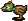

This guide specifically covers information for Mystery Dungeon 2: Shiren the Wanderer
for the Super Famicom. I wanted to create this guide because I became fascinated
by this game after watching my friend dot_lvl play it. I became a little frustrated
because all of the information available in English was specific to the DS version,
or just unavailable.

Even in various Twitch chats and Discord servers, people would answer questions
specific the Super Famicom version of the game, only to be wrong because they were
only familiar with the DS version and they were unaware how different the games were.

The changes are pretty significant. Strategies employed 

## List of Known Differences

#### New Dungeons

The DS version added new dungeons

#### New Monsters

- New monster types have been added. e.g. Tiger Uho / Tiger Thrower is new in DS
  - Parthenos, which was included in the game but went unused exists in DS
- Most enemies have 4 levels. Even Monsters that only had a single level now have
  4 levels. Healer Rabbit still only has 1 level (Fluffy Bunny in DS)

#### Changes to existing Monsters

Existing monster types have been altered. Different HP, Attack, Defense, EXP rewards
for most monsters

One frustrating example is the  Chicken
awards only 1 experience instead of 200, making attempts at defeating a  Master Chicken usually result in getting
no reward.

#### Changes to existing Dungeons

While the existing dungeons have the same flow (e.g. Table Mountain is still 30
Floors), the Monster table and Item Table for the dungeon has been altered. Not
only have the new enemies been added in, but shuffled around existing enemies.

#### Damage Calculations

The damage Calculations are different. In SFC, Shield Strength was valued higher
as the damage calculation appeared to have an expoential relationship with the damage
you receive, and after a point Sword Strength starts to plateau.

In the DS version, the Sword Strength / Shield Strength relationship largely seems
to be linearly proportional to the damage output.

#### New Items

New Items