## Monster List

### Table Explanation

- Lv = Monster level
- HP = Monster's hit points
- Atk = Monster's attack power
- Def = Monster's defense
- Exp = Experience points awarded
- Type = Weakness type

Type:

- Drain = Weak to Drain Buster.
- Dragon = Weak to Dragonkiller.
- One-Eyed = Weak to Cyclops Killer.
- Ghost = Weak to Sickle Slayer, HP restoring items deal damage.

Speed:

- Slow = Takes an action every other turn.
- Swift 1 = Takes 2 actions per turn, max 1 attack/ability
- Swift 2 = Takes 2 actions per turn.

### Absorber Larva

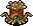

<table class="monsterPageTable">
  <tr>
    <th>Lv</th>
    <th>Name</th>
    <th>JP Name</th>
    <th>HP</th>
    <th>EXP</th>
    <th>ATK</th>
    <th>DEF</th>
    <th>Type</th>
    <th>Notes</th>
  </tr>
  <tr>
    <td>1</td>
    <td>Absorber Larva</td>
    <td>吸引幼虫</td>
    <td>40</td>
    <td>30</td>
    <td>24</td>
    <td>15</td>
    <td rowspan="3">Drain One-eyed</td>
    <td>Lowers max Strength by 1</td>
  </tr>
  <tr>
    <td>2</td>
    <td>Absorber Bug</td>
    <td>吸引虫</td>
    <td>40</td>
    <td>50</td>
    <td>25</td>
    <td>21</td>
    <td>Lowers max Strength by 2</td>
  </tr>
  <tr>
    <td>3</td>
    <td>Mature Absorber</td>
    <td>吸引成虫</td>
    <td>80</td>
    <td>500</td>
    <td>255</td>
    <td>29</td>
    <td>Lowers max Strength by 3</td>
  </tr>
</table>

### Bean Bandit

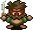

<table class="monsterPageTable">
  <tr>
    <th>Lv</th>
    <th>Name</th>
    <th>JP Name</th>
    <th>HP</th>
    <th>EXP</th>
    <th>ATK</th>
    <th>DEF</th>
    <th>Type</th>
    <th>Notes</th>
  </tr>
  <tr>
    <td>1</td>
    <td>Bean Bandit</td>
    <td>豆山賊</td>
    <td>6</td>
    <td>5</td>
    <td>4</td>
    <td>1</td>
    <td rowspan="3">None</td>
    <td rowspan="3">No Abilities</td>
  </tr>
  <tr>
    <td>2</td>
    <td>Bandit</td>
    <td>山賊</td>
    <td>12</td>
    <td>15</td>
    <td>7</td>
    <td>10</td>
  </tr>
  <tr>
    <td>3</td>
    <td>Bandit Boss</td>
    <td>山賊親分</td>
    <td>12</td>
    <td>20</td>
    <td>9</td>
    <td>13</td>
  </tr>
</table>

### Bowya

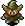

<table class="monsterPageTable">
  <tr>
    <th>Lv</th>
    <th>Name</th>
    <th>JP Name</th>
    <th>HP</th>
    <th>EXP</th>
    <th>ATK</th>
    <th>DEF</th>
    <th>Type</th>
    <th>Notes</th>
  </tr>
  <tr>
    <td>1</td>
    <td>Bowya</td>
    <td>ボウヤー</td>
    <td>7</td>
    <td>4</td>
    <td>4</td>
    <td>10</td>
    <td rowspan="4">None</td>
    <td></td>
  </tr>
  <tr>
    <td>2</td>
    <td>Cross bowya</td>
    <td>クロスボウヤー</td>
    <td>20</td>
    <td>35</td>
    <td>14</td>
    <td>14</td>
    <td></td>
  </tr>
  <tr>
    <td>3</td>
    <td>Kid Tank</td>
    <td>コドモ戦車</td>
    <td>25</td>
    <td>40</td>
    <td>17</td>
    <td>9</td>
    <td></td>
  </tr>
  <tr>
    <td>4</td>
    <td>Mini Tank</td>
    <td>ちびタンク</td>
    <td>25</td>
    <td>65</td>
    <td>20</td>
    <td>23</td>
    <td></td>
  </tr>
</table>

### Chicken

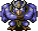

<table class="monsterPageTable">
  <tr>
    <th>Lv</th>
    <th>Name</th>
    <th>JP Name</th>
    <th>HP</th>
    <th>EXP</th>
    <th>ATK</th>
    <th>DEF</th>
    <th>Type</th>
    <th>Notes</th>
  </tr>
  <tr>
    <td>1</td>
    <td>Chicken</td>
    <td>チキン</td>
    <td>4</td>
    <td>200</td>
    <td>1</td>
    <td>1</td>
    <td rowspan="3">None</td>
    <td>Speed: Swift 1. Escapes from Shiren</td>
  </tr>
  <tr>
    <td>2</td>
    <td>Master Chicken</td>
    <td>マスターチキン</td>
    <td>50</td>
    <td>400</td>
    <td>43</td>
    <td>22</td>
    <td>When HP is < 16, turns into a Chicken.</td>
  </tr>
  <tr>
    <td>3</td>
    <td>Great Chicken</td>
    <td>グレートチキン</td>
    <td>90</td>
    <td>1000</td>
    <td>255</td>
    <td>26</td>
    <td>Swift 1. When HP is < 16, turns into a Chicken.</td>
  </tr>
</table>

### Dark Owl

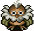

<table class="monsterPageTable">
  <tr>
    <th>Lv</th>
    <th>Name</th>
    <th>JP Name</th>
    <th>HP</th>
    <th>EXP</th>
    <th>ATK</th>
    <th>DEF</th>
    <th>Type</th>
    <th>Notes</th>
  </tr>
  <tr>
    <td>1</td>
    <td>Dark Owl</td>
    <td>やみふくろう</td>
    <td>4</td>
    <td>15</td>
    <td>9</td>
    <td>32</td>
    <td>None</td>
    <td>Darkens room, stays in place.</td>
  </tr>
</table>

### Debuta

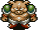
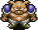

<table class="monsterPageTable">
  <tr>
    <th>Lv</th>
    <th>Name</th>
    <th>JP Name</th>
    <th>HP</th>
    <th>EXP</th>
    <th>ATK</th>
    <th>DEF</th>
    <th>Type</th>
    <th>Notes</th>
  </tr>
  <tr>
    <td>1</td>
    <td>Debuta</td>
    <td>デブータ</td>
    <td>25</td>
    <td>23</td>
    <td>9</td>
    <td>9</td>
    <td rowspan="3">None</td>
    <td>Throws a rock over enemies and walls, can see in hallways and in the dark.
       Range is 2 tiles.</td>
  </tr>
  <tr>
    <td>2</td>
    <td>Debucho</td>
    <td>デブーチョ</td>
    <td>50</td>
    <td>200</td>
    <td>22</td>
    <td>25</td>
    <td>Range is 5 tiles</td>
  </tr>
  <tr>
    <td>3</td>
    <td>Debuton</td>
    <td>デブートン</td>
    <td>105</td>
    <td>1000</td>
    <td>255</td>
    <td>26</td>
    <td>Range is 10 tiles</td>
  </tr>
</table>

### Dragon

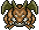

<table class="monsterPageTable">
  <tr>
    <th>Lv</th>
    <th>Name</th>
    <th>JP Name</th>
    <th>HP</th>
    <th>EXP</th>
    <th>ATK</th>
    <th>DEF</th>
    <th>Type</th>
    <th>Notes</th>
  </tr>
  <tr>
    <td>1</td>
    <td>Dragon</td>
    <td>ドラゴン</td>
    <td>90</td>
    <td>2500</td>
    <td>76</td>
    <td>28</td>
    <td rowspan="3">Dragon</td>
    <td>Shoots fire in a straight line dealing 30 damage</td>
  </tr>
  <tr>
    <td>2</td>
    <td>Sky Dragon</td>
    <td>スカイドラゴン</td>
    <td>100</td>
    <td>5000</td>
    <td>255</td>
    <td>35</td>
    <td>Shoots fire in the same room dealing 40 damage</td>
  </tr>
  <tr>
    <td>3</td>
    <td>Arch Dragon</td>
    <td>アークドラゴン</td>
    <td>120</td>
    <td>8000</td>
    <td>255</td>
    <td>39</td>
    <td>Shoots fire across the whole floor dealing 50 damage</td>
  </tr>
</table>

### Dremlas

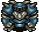

<table class="monsterPageTable">
  <tr>
    <th>Lv</th>
    <th>Name</th>
    <th>JP Name</th>
    <th>HP</th>
    <th>EXP</th>
    <th>ATK</th>
    <th>DEF</th>
    <th>Type</th>
    <th>Notes</th>
  </tr>
  <tr>
    <td>1</td>
    <td>Dremlas</td>
    <td>ドレムラス</td>
    <td>45</td>
    <td>100</td>
    <td>36</td>
    <td>17</td>
    <td rowspan="3">None</td>
    <td rowspan="3"></td>
  </tr>
  <tr>
    <td>2</td>
    <td>Madremlas</td>
    <td>マッドレムラス</td>
    <td>70</td>
    <td>1100</td>
    <td>50</td>
    <td>24</td>
  </tr>
  <tr>
    <td>3</td>
    <td>Hardremlas</td>
    <td>ハードレムラス</td>
    <td>130</td>
    <td>2000</td>
    <td>255</td>
    <td>28</td>
  </tr>
</table>

### Ether Devil

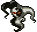

<table class="monsterPageTable">
  <tr>
    <th>Lv</th>
    <th>Name</th>
    <th>JP Name</th>
    <th>HP</th>
    <th>EXP</th>
    <th>ATK</th>
    <th>DEF</th>
    <th>Type</th>
    <th>Notes</th>
  </tr>
  <tr>
    <td>1</td>
    <td>Ether Devil</td>
    <td>エーテルデビル</td>
    <td>50</td>
    <td>50</td>
    <td>27</td>
    <td>12</td>
    <td>Ghost</td>
    <td>Invisible.Moves erratically. Moves and sees through walls. Reflects Magic</td>
  </tr>
</table>

### Face-First Warrior

<table class="monsterPageTable">
  <tr>
    <th>Lv</th>
    <th>Name</th>
    <th>JP Name</th>
    <th>HP</th>
    <th>EXP</th>
    <th>ATK</th>
    <th>DEF</th>
    <th>Type</th>
    <th>Notes</th>
  </tr>
  <tr>
    <td>1</td>
    <td>Face-First Warrior</td>
    <td>正面戦士</td>
    <td>50</td>
    <td>200</td>
    <td>48</td>
    <td>35</td>
    <td rowspan="3">None</td>
    <td rowspan="3">High defense. 
      Instant death when damaged on it's flank or back</td>
  </tr>
  <tr>
    <td>2</td>
    <td>Face-First Fighter</td>
    <td>正面ファイター</td>
    <td>100</td>
    <td>2000</td>
    <td>255</td>
    <td>35</td>
  </tr>
  <tr>
    <td>3</td>
    <td>Face-first Master</td>
    <td>正面マスター</td>
    <td>250</td>
    <td>6000</td>
    <td>255</td>
    <td>33</td>
  </tr>
</table>

### Field Raider

<table class="monsterPageTable">
  <tr>
    <th>Lv</th>
    <th>Name</th>
    <th>JP Name</th>
    <th>HP</th>
    <th>EXP</th>
    <th>ATK</th>
    <th>DEF</th>
    <th>Type</th>
    <th>Notes</th>
  </tr>
  <tr>
    <td>1</td>
    <td>Field Raider</td>
    <td>畠荒らし</td>
    <td>12</td>
    <td>12</td>
    <td>8</td>
    <td>11</td>
    <td rowspan="3">None</td>
    <td>Will turn items on the ground into Weeds</td>
  </tr>
  <tr>
    <td>2</td>
    <td>Pot Raider</td>
    <td>壺荒らし</td>
    <td>15</td>
    <td>15</td>
    <td>13</td>
    <td>11</td>
    <td>Also throws Weeds into Pots</td>
  </tr>
  <tr>
    <td>3</td>
    <td>Item Wrecker</td>
    <td>物荒らし</td>
    <td>20</td>
    <td>20</td>
    <td>19</td>
    <td>11</td>
    <td>Also turns Shiren's items into Weeds</td>
  </tr>
</table>

### Flame Priest

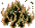

<table class="monsterPageTable">
  <tr>
    <th>Lv</th>
    <th>Name</th>
    <th>JP Name</th>
    <th>HP</th>
    <th>EXP</th>
    <th>ATK</th>
    <th>DEF</th>
    <th>Type</th>
    <th>Notes</th>
  </tr>
  <tr>
    <td>2</td>
    <td>Flame Priest</td>
    <td>火炎入道</td>
    <td>35</td>
    <td>60</td>
    <td>32</td>
    <td>12</td>
    <td rowspan="3">None</td>
    <td rowspan="3">Level Up with Fire 
      Multiplies from explosions 
      Thrown items are ineffective</td>
  </tr>
  <tr>
    <td>3</td>
    <td>Flame Priest 2</td>
    <td>火炎入道2</td>
    <td>65</td>
    <td>170</td>
    <td>48</td>
    <td>19</td>
  </tr>
  <tr>
    <td>1</td>
    <td>Flame Priest 3</td>
    <td>火炎入道3</td>
    <td>70</td>
    <td>300</td>
    <td>243</td>
    <td>27</td>
  </tr>
</table>

### Haboon

<table class="monsterPageTable">
  <tr>
    <th>Lv</th>
    <th>Name</th>
    <th>JP Name</th>
    <th>HP</th>
    <th>EXP</th>
    <th>ATK</th>
    <th>DEF</th>
    <th>Type</th>
    <th>Notes</th>
  </tr>
  <tr>
    <td>1</td>
    <td>Haboon</td>
    <td>ハブーン</td>
    <td>11</td>
    <td>10</td>
    <td>10</td>
    <td>9</td>
    <td rowspan="3">None</td>
    <td rowspan="3">No special abilities</td>
  </tr>
  <tr>
    <td>2</td>
    <td>Mamoon</td>
    <td>マムーン</td>
    <td>25</td>
    <td>50</td>
    <td>26</td>
    <td>18</td>
  </tr>
  <tr>
    <td>3</td>
    <td>Nishikeen</td>
    <td>ニシキーン</td>
    <td>70</td>
    <td>700</td>
    <td>229</td>
    <td>30</td>
  </tr>
</table>

### Healer Rabbit

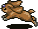

<table class="monsterPageTable">
  <tr>
    <th>Lv</th>
    <th>Name</th>
    <th>JP Name</th>
    <th>HP</th>
    <th>EXP</th>
    <th>ATK</th>
    <th>DEF</th>
    <th>Type</th>
    <th>Notes</th>
  </tr>
  <tr>
    <td>1</td>
    <td>Healer Rabbit</td>
    <td>いやしウサギ</td>
    <td>6</td>
    <td>6</td>
    <td>7</td>
    <td>28</td>
    <td rowspan="3">None</td>
    <td rowspan="3">Teleports to allied monsters to heal them</td>
  </tr>
</table>

### Gamara

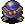

<table class="monsterPageTable">
  <tr>
    <th>Lv</th>
    <th>Name</th>
    <th>JP Name</th>
    <th>HP</th>
    <th>EXP</th>
    <th>ATK</th>
    <th>DEF</th>
    <th>Type</th>
    <th>Notes</th>
  </tr>
  <tr>
    <td>1</td>
    <td>Gamara</td>
    <td>ガマラ</td>
    <td>10</td>
    <td>5</td>
    <td>0</td>
    <td>7</td>
    <td rowspan="3">None</td>
    <td rowspan="3">Steals Gitan from Shiren. Warps away and moves at double speed</td>
  </tr>
  <tr>
    <td>2</td>
    <td>Gamagucchi</td>
    <td>ガマグッチ</td>
    <td>40</td>
    <td>20</td>
    <td>0</td>
    <td>5</td>
  </tr>
  <tr>
    <td>3</td>
    <td>Gamagon</td>
    <td>ガマゴン</td>
    <td>50</td>
    <td>800</td>
    <td>0</td>
    <td>34</td>
  </tr>
</table>

### Gaze

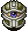

<table class="monsterPageTable">
  <tr>
    <th>Lv</th>
    <th>Name</th>
    <th>JP Name</th>
    <th>HP</th>
    <th>EXP</th>
    <th>ATK</th>
    <th>DEF</th>
    <th>Type</th>
    <th>Notes</th>
  </tr>
  <tr>
    <td>1</td>
    <td>Gaze</td>
    <td>ゲイズ</td>
    <td>20</td>
    <td>15</td>
    <td>17</td>
    <td>12</td>
    <td rowspan="3">One-eyed</td>
    <td rowspan="3">Casts Hypnosis on Shiren to take a random action</td>
  </tr>
  <tr>
    <td>2</td>
    <td>Super Gaze</td>
    <td>スーパーゲイズ</td>
    <td>51</td>
    <td>300</td>
    <td>29</td>
    <td>19</td>
  </tr>
  <tr>
    <td>3</td>
    <td>Hyper Gaze</td>
    <td>ハイパーゲイズ</td>
    <td>110</td>
    <td>2000</td>
    <td>225</td>
    <td>33</td>
  </tr>
</table>

### Gyazar

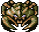

<table class="monsterPageTable">
  <tr>
    <th>Lv</th>
    <th>Name</th>
    <th>JP Name</th>
    <th>HP</th>
    <th>EXP</th>
    <th>ATK</th>
    <th>DEF</th>
    <th>Type</th>
    <th>Notes</th>
  </tr>
  <tr>
    <td>1</td>
    <td>Gyazar</td>
    <td>ギャザー</td>
    <td>50</td>
    <td>135</td>
    <td>38</td>
    <td>19</td>
    <td rowspan="3">None</td>
    <td rowspan="3">No special abilities</td>
  </tr>
  <tr>
    <td>2</td>
    <td>Killer Gyazar</td>
    <td>キラーギャザー</td>
    <td>60</td>
    <td>500</td>
    <td>208</td>
    <td>33</td>
  </tr>
  <tr>
    <td>3</td>
    <td>Hell Gyazar</td>
    <td>ヘルギャザー</td>
    <td>120</td>
    <td>200</td>
    <td>255</td>
    <td>29</td>
  </tr>
</table>

### Impasse Dragon

<table class="monsterPageTable">
  <tr>
    <th>Lv</th>
    <th>Name</th>
    <th>JP Name</th>
    <th>HP</th>
    <th>EXP</th>
    <th>ATK</th>
    <th>DEF</th>
    <th>Type</th>
    <th>Notes</th>
  </tr>
  <tr>
    <td>1</td>
    <td>Impasse Dragon</td>
    <td>とおせんりゅう</td>
    <td>12</td>
    <td>8</td>
    <td>11</td>
    <td>11</td>
    <td rowspan="3">Dragon</td>
    <td rowspan="3">When next to Shiren and there is monster behind it: 
        will pass through Shiren to surround him.</td>
  </tr>
  <tr>
    <td>2</td>
    <td>Dragon Head</td>
    <td>ドラゴンヘッド</td>
    <td>75</td>
    <td>500</td>
    <td>55</td>
    <td>23</td>
  </tr>
  <tr>
    <td>3</td>
    <td>Through Dragon</td>
    <td>スルードラゴン</td>
    <td>80</td>
    <td>1000</td>
    <td>243</td>
    <td>27</td>
  </tr>
</table>

### Iron Head

<table class="monsterPageTable">
  <tr>
    <th>Lv</th>
    <th>Name</th>
    <th>JP Name</th>
    <th>HP</th>
    <th>EXP</th>
    <th>ATK</th>
    <th>DEF</th>
    <th>Type</th>
    <th>Notes</th>
  </tr>
  <tr>
    <td>1</td>
    <td>Iron Head</td>
    <td>アイアンヘッド</td>
    <td>15</td>
    <td>20</td>
    <td>13</td>
    <td>5</td>
    <td rowspan="3">None</td>
    <td rowspan="3">Unlike future Shiren games, these have normal attack range</td>
  </tr>
  <tr>
    <td>2</td>
    <td>Chain Head</td>
    <td>チェインヘッド</td>
    <td>60</td>
    <td>500</td>
    <td>48</td>
    <td>21</td>
  </tr>
  <tr>
    <td>3</td>
    <td>Giga Head</td>
    <td>ギガヘッド</td>
    <td>65</td>
    <td>1200</td>
    <td>255</td>
    <td>30</td>
  </tr>
</table>

### Karakuroid

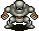

<table class="monsterPageTable">
  <tr>
    <th>Lv</th>
    <th>Name</th>
    <th>JP Name</th>
    <th>HP</th>
    <th>EXP</th>
    <th>ATK</th>
    <th>DEF</th>
    <th>Type</th>
    <th>Notes</th>
  </tr>
  <tr>
    <td>1</td>
    <td>Karakuroid</td>
    <td>カラクロイド</td>
    <td>50</td>
    <td>250</td>
    <td>48</td>
    <td>21</td>
    <td>None</td>
    <td>Creates traps at their feet. Speed: Swift 1.</td>
  </tr>
  </tr>
</table>

### Kid Tengu

<table class="monsterPageTable">
  <tr>
    <th>Lv</th>
    <th>Name</th>
    <th>JP Name</th>
    <th>HP</th>
    <th>EXP</th>
    <th>ATK</th>
    <th>DEF</th>
    <th>Type</th>
    <th>Notes</th>
  </tr>
  <tr>
    <td>1</td>
    <td>Kid Tengu</td>
    <td>小僧天狗</td>
    <td>6</td>
    <td>3</td>
    <td>3</td>
    <td>4</td>
    <td rowspan="3">None</td>
    <td rowspan="3">No special abilities</td>
  </tr>
  <tr>
    <td>2</td>
    <td>Crow Tengu</td>
    <td>カラス天狗</td>
    <td>6</td>
    <td>5</td>
    <td>9</td>
    <td>13</td>
  </tr>
  <tr>
    <td>3</td>
    <td>Tengu Master</td>
    <td>天狗師匠</td>
    <td>7</td>
    <td>8</td>
    <td>10</td>
    <td>10</td>
  </tr>
</table>

### Kigni Tribe

<table class="monsterPageTable">
  <tr>
    <th>Lv</th>
    <th>Name</th>
    <th>JP Name</th>
    <th>HP</th>
    <th>EXP</th>
    <th>ATK</th>
    <th>DEF</th>
    <th>Type</th>
    <th>Notes</th>
  </tr>
  <tr>
    <td>1</td>
    <td>Kigni Tribe</td>
    <td>キグニ族</td>
    <td>40</td>
    <td>45</td>
    <td>17</td>
    <td>8</td>
    <td rowspan="3">None</td>
    <td rowspan="3">Will attack nearby monsters</td>
  </tr>
  <tr>
    <td>2</td>
    <td>Kigni Tribe 2</td>
    <td>キグニ族2</td>
    <td>60</td>
    <td>100</td>
    <td>39</td>
    <td>15</td>
  </tr>
  <tr>
    <td>3</td>
    <td>Kigni Tribe 3</td>
    <td>キグニ族3</td>
    <td>70</td>
    <td>150</td>
    <td>48</td>
    <td>17</td>
  </tr>
</table>

### Kimen Musha

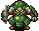

<table class="monsterPageTable">
  <tr>
    <th>Lv</th>
    <th>Name</th>
    <th>JP Name</th>
    <th>HP</th>
    <th>EXP</th>
    <th>ATK</th>
    <th>DEF</th>
    <th>Type</th>
    <th>Notes</th>
  </tr>
  <tr>
    <td>1</td>
    <td>Kimen Musha</td>
    <td>鬼面武者</td>
    <td>10</td>
    <td>15</td>
    <td>7</td>
    <td>17</td>
    <td rowspan="3">None</td>
    <td rowspan="3">Will spawn a Ghost Musha several turns after death</td>
  </tr>
  <tr>
    <td>2</td>
    <td>Hannya Musha</td>
    <td>はんにゃ武者</td>
    <td>16</td>
    <td>50</td>
    <td>17</td>
    <td>19</td>
  </tr>
  <tr>
    <td>3</td>
    <td>Shogun</td>
    <td>将軍</td>
    <td>40</td>
    <td>50</td>
    <td>24</td>
    <td>21</td>
  </tr>
</table>

<table class="monsterPageTable">
  <tr>
    <th>Lv</th>
    <th>Name</th>
    <th>JP Name</th>
    <th>HP</th>
    <th>EXP</th>
    <th>ATK</th>
    <th>DEF</th>
    <th>Type</th>
    <th>Notes</th>
  </tr>
  <tr>
    <td>1</td>
    <td>Ghost Musha</td>
    <td>ぼうれい武者</td>
    <td>4</td>
    <td>10</td>
    <td>13</td>
    <td>17</td>
    <td>Ghost</td>
    <td>Possesses other monsters to promote them</td>
  </tr>
</table>

### Knife Gator

<table class="monsterPageTable">
  <tr>
    <th>Lv</th>
    <th>Name</th>
    <th>JP Name</th>
    <th>HP</th>
    <th>EXP</th>
    <th>ATK</th>
    <th>DEF</th>
    <th>Type</th>
    <th>Notes</th>
  </tr>
  <tr>
    <td>1</td>
    <td>Knife Gator</td>
    <td>ナイフゲータ</td>
    <td>7</td>
    <td>4</td>
    <td>4</td>
    <td>1</td>
    <td rowspan="3">None</td>
    <td>No special abilities</td>
  </tr>
  <tr>
    <td>2</td>
    <td>Sabre Gator</td>
    <td>サーベルゲータ</td>
    <td>40</td>
    <td>80</td>
    <td>27</td>
    <td>16</td>
    <td>Attacks 2 times</td>
  </tr>
  <tr>
    <td>3</td>
    <td>Blade Gator</td>
    <td>ブレイドゲータ</td>
    <td>100</td>
    <td>1000</td>
    <td>255</td>
    <td>30</td>
    <td>Attacks 3 times</td>
  </tr>
</table>

### Mamul

<table class="monsterPageTable">
  <tr>
    <th>Lv</th>
    <th>Name</th>
    <th>JP Name</th>
    <th>HP</th>
    <th>EXP</th>
    <th>ATK</th>
    <th>DEF</th>
    <th>Type</th>
    <th>Notes</th>
  </tr>
  <tr>
    <td>1</td>
    <td>Mamul</td>
    <td>マムル</td>
    <td>5</td>
    <td>2</td>
    <td>2</td>
    <td>1</td>
    <td rowspan="3">None</td>
    <td rowspan="2">No Special Abilities</td>
  </tr>
  <tr>
    <td>2</td>
    <td>Subterranean Mamul</td>
    <td>あなぐらマムル</td>
    <td>5</td>
    <td>3</td>
    <td>3</td>
    <td>9</td>
  </tr>
  <tr>
    <td>3</td>
    <td>Cave Mamul</td>
    <td>洞窟マムル</td>
    <td>5</td>
    <td>1000</td>
    <td>255</td>
    <td>78</td>
    <td>Extreme Defense</td>
  </tr>
</table>

### Midoro

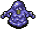

<table class="monsterPageTable">
  <tr>
    <th>Lv</th>
    <th>Name</th>
    <th>JP Name</th>
    <th>HP</th>
    <th>EXP</th>
    <th>ATK</th>
    <th>DEF</th>
    <th>Type</th>
    <th>Notes</th>
  </tr>
  <tr>
    <td>1</td>
    <td>Midoro</td>
    <td>ミドロ</td>
    <td>12</td>
    <td>4</td>
    <td>0</td>
    <td>9</td>
    <td rowspan="3">None</td>
    <td>Rusts equipped weapon or shield</td>
  </tr>
  <tr>
    <td>2</td>
    <td>Gedoro</td>
    <td>ゲドロ</td>
    <td>35</td>
    <td>90</td>
    <td>0</td>
    <td>15</td>
    <td>Rusts equipped weapon or shield. Chance to multiply when damaged.</td>
  </tr>
  <tr>
    <td>3</td>
    <td>Odoro</td>
    <td>オドロ</td>
    <td>60</td>
    <td>200</td>
    <td>0</td>
    <td>30</td>
    <td>Erases plating and other abilities on weapons or shields</td>
  </tr>
</table>

### Minion of Death

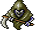

<table class="monsterPageTable">
  <tr>
    <th>Lv</th>
    <th>Name</th>
    <th>JP Name</th>
    <th>HP</th>
    <th>EXP</th>
    <th>ATK</th>
    <th>DEF</th>
    <th>Type</th>
    <th>Notes</th>
  </tr>
  <tr>
    <td>1</td>
    <td>Minion of Death</td>
    <td>死の使い</td>
    <td>25</td>
    <td>30</td>
    <td>15</td>
    <td>8</td>
    <td rowspan="3">Ghost</td>
    <td>Speed: Swift 1</td>
  </tr>
  <tr>
    <td>2</td>
    <td>Minion of Hell</td>
    <td>地獄の使者</td>
    <td>45</td>
    <td>130</td>
    <td>18</td>
    <td>18</td>
    <td>Speed: Swift 2</td>
  </tr>
  <tr>
    <td>3</td>
    <td>Death</td>
    <td>死神</td>
    <td>65</td>
    <td>950</td>
    <td>33</td>
    <td>25</td>
    <td>Speed: Swift 2. Can travel and see through walls</td>
  </tr>
</table>

### Mist Hermit

<table class="monsterPageTable">
  <tr>
    <th>Lv</th>
    <th>Name</th>
    <th>JP Name</th>
    <th>HP</th>
    <th>EXP</th>
    <th>ATK</th>
    <th>DEF</th>
    <th>Type</th>
    <th>Notes</th>
  </tr>
  <tr>
    <td>1</td>
    <td>Mist Hermit</td>
    <td>きり仙人</td>
    <td>30</td>
    <td>30</td>
    <td>17</td>
    <td>15</td>
    <td rowspan="3">None</td>
    <td>Range: 1 Tile  
        Casts a strange spell dealing damage over time to Shiren. Stacks. 
        1st: Removes Shiren's Natural healing. 2+: Deals damage per turn</td>
  </tr>
  <tr>
    <td>2</td>
    <td>Fog Hermit</td>
    <td>みの仙人</td>
    <td>65</td>
    <td>150</td>
    <td>39</td>
    <td>17</td>
    <td>Range: Straight line</td>
  </tr>
  <tr>
    <td>3</td>
    <td>Haze Hermit</td>
    <td>かすみ仙人</td>
    <td>90</td>
    <td>1000</td>
    <td>255</td>
    <td>26</td>
    <td>Range: Room</td>
  </tr>
</table>

### Monster Nigiri Beast

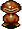

<table class="monsterPageTable">
  <tr>
    <th>Lv</th>
    <th>Name</th>
    <th>JP Name</th>
    <th>HP</th>
    <th>EXP</th>
    <th>ATK</th>
    <th>DEF</th>
    <th>Type</th>
    <th>Notes</th>
  </tr>
  <tr>
    <td>1</td>
    <td>Monster Nigiri Beast</td>
    <td>妖怪にぎり変化</td>
    <td>10</td>
    <td>10</td>
    <td>7</td>
    <td>4</td>
    <td rowspan="3">None</td>
    <td>Can turn an item in Shiren's inventory into a Large Rice Ball</td>
  </tr>
  <tr>
    <td>2</td>
    <td>Monster Nigiri Leader</td>
    <td>妖怪にぎり親方</td>
    <td>15</td>
    <td>75</td>
    <td>13</td>
    <td>11</td>
    <td>Can turn Shiren into a Rice Ball</td>
  </tr>
  <tr>
    <td>3</td>
    <td>Monster Nigiri Boss</td>
    <td>妖怪にぎり元締</td>
    <td>50</td>
    <td>200</td>
    <td>31</td>
    <td>16</td>
    <td>Can turn Shiren into a Rice Ball and Shiren's inventory into Large Rice Balls</td>
  </tr>
</table>

### Monster Radish

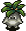

<table class="monsterPageTable">
  <tr>
    <th>Lv</th>
    <th>Name</th>
    <th>JP Name</th>
    <th>HP</th>
    <th>EXP</th>
    <th>ATK</th>
    <th>DEF</th>
    <th>Type</th>
    <th>Notes</th>
  </tr>
  <tr >
    <td>1</td>
    <td>Monster Radish</td>
    <td>おばけ大根</td>
    <td>8</td>
    <td>8</td>
    <td>5</td>
    <td>10</td>
    <td rowspan="3">Ghost</td>
    <td>Throws Poison Herb with a range of 2.</td>
  </tr>
  <tr>
    <td>2</td>
    <td>Dizzy Daikon</td>
    <td>めまわし大根</td>
    <td>45</td>
    <td>80</td>
    <td>27</td>
    <td>13</td>
    <td>Throws Confusion Herb, then Poison Grass with a range of 5.</td>
  </tr>
  <tr>
    <td>3</td>
    <td>Sleepy Daikon</td>
    <td>ねむり大根</td>
    <td>50</td>
    <td>120</td>
    <td>27</td>
    <td>17</td>
    <td>Throws Sleep Herb with a range of 5.</td>
  </tr>
</table>

### Nduba

<table class="monsterPageTable">
  <tr>
    <th>Lv</th>
    <th>Name</th>
    <th>JP Name</th>
    <th>HP</th>
    <th>EXP</th>
    <th>ATK</th>
    <th>DEF</th>
    <th>Type</th>
    <th>Notes</th>
  </tr>
  <tr>
    <td>1</td>
    <td>Nduba</td>
    <td>ンドゥバ</td>
    <td>50</td>
    <td>12</td>
    <td>15</td>
    <td>1</td>
    <td rowspan="3">None</td>
    <td rowspan="3">Disguised as an item or stairs in Stores or Destructible pillars</td>
  </tr>
  <tr>
    <td>2</td>
    <td>Nduba</td>
    <td>ンドゥルー</td>
    <td>50</td>
    <td>250</td>
    <td>39</td>
    <td>20</td>
  </tr>
  <tr>
    <td>3</td>
    <td>Ndulu</td>
    <td>ンバマ</td>
    <td>50</td>
    <td>500</td>
    <td>44</td>
    <td>29</td>
  </tr>
</table>

### Norojo

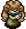

<table class="monsterPageTable">
  <tr>
    <th>Lv</th>
    <th>Name</th>
    <th>JP Name</th>
    <th>HP</th>
    <th>EXP</th>
    <th>ATK</th>
    <th>DEF</th>
    <th>Type</th>
    <th>Notes</th>
  </tr>
  <tr>
    <td>1</td>
    <td>Norojo</td>
    <td>ノロージョ</td>
    <td>27</td>
    <td>40</td>
    <td>27</td>
    <td>10</td>
    <td rowspan="3">None</td>
    <td>Curses equipped shield</td>
  </tr>
  <tr>
    <td>2</td>
    <td>Norojo's Big Sister</td>
    <td>ノロージョの姉</td>
    <td>40</td>
    <td>100</td>
    <td>36</td>
    <td>19</td>
    <td>Curses equipped shield, weapon, bracer</td>
  </tr>
  <tr>
    <td>3</td>
    <td>Norojo's Mom</td>
    <td>ノロージョの母</td>
    <td>75</td>
    <td>300</td>
    <td>104</td>
    <td>31</td>
    <td>Curses all shields, weapons, bracers in Shiren's inventory</td>
  </tr>
</table>

### Old Man Tank

<table class="monsterPageTable">
  <tr>
    <th>Lv</th>
    <th>Name</th>
    <th>JP Name</th>
    <th>HP</th>
    <th>EXP</th>
    <th>ATK</th>
    <th>DEF</th>
    <th>Type</th>
    <th>Notes</th>
  </tr>
  <tr>
    <td>1</td>
    <td>Old Man Tank</td>
    <td>オヤジ戦車</td>
    <td>30</td>
    <td>70</td>
    <td>9</td>
    <td>18</td>
    <td rowspan="3">None</td>
    <td>Shoots an explosive shot dealing 20 damage. Speed: Slow</td>
  </tr>
  <tr>
    <td>2</td>
    <td>Stubborn Tank</td>
    <td>ガンコ戦車</td>
    <td>40</td>
    <td>300</td>
    <td>10</td>
    <td>26</td>
    <td>Shoots an explosive shot dealing 30 damage. Speed: Normal</td>
  </tr>
  <tr>
    <td>3</td>
    <td>Obstinate Tank</td>
    <td>イッテツ戦車</td>
    <td>50</td>
    <td>1000</td>
    <td>238</td>
    <td>39</td>
    <td>Shoots an explosive shot dealing 40 damage. Speed: Swift 2</td>
  </tr>
</table>

### Peetan

<table class="monsterPageTable">
  <tr>
    <th>Lv</th>
    <th>Name</th>
    <th>JP Name</th>
    <th>HP</th>
    <th>EXP</th>
    <th>ATK</th>
    <th>DEF</th>
    <th>Type</th>
    <th>Notes</th>
  </tr>
  <tr>
    <td>1</td>
    <td>Peetan</td>
    <td>ぴーたん</td>
    <td>5</td>
    <td>7</td>
    <td>2</td>
    <td>14</td>
    <td rowspan="3">One-eyed</td>
    <td>Runs from Shiren. Speed: Swift 2. Always drops Rice Ball.</td>
  </tr>
  <tr>
    <td>2</td>
    <td>Fleeing Peetan</td>
    <td>逃げピータン</td>
    <td>5</td>
    <td>50</td>
    <td>2</td>
    <td>37</td>
    <td>Runs from Shiren. Speed: Swift 2. Teleports when attacked. 
        Always dropped Large Rice Ball.</td>
  </tr>
  <tr>
    <td>3</td>
    <td>Flying Peetan</td>
    <td>逃げピータン</td>
    <td>10</td>
    <td>150</td>
    <td>2</td>
    <td>31</td>
    <td>Teleports when Shiren is close. Always drops an item found in stores</td>
  </tr>
</table>

### Pumkorepkin

<table class="monsterPageTable">
  <tr>
    <th>Lv</th>
    <th>Name</th>
    <th>JP Name</th>
    <th>HP</th>
    <th>EXP</th>
    <th>ATK</th>
    <th>DEF</th>
    <th>Type</th>
    <th>Notes</th>
  </tr>
  <tr>
    <td>1</td>
    <td>Pumkorepkin</td>
    <td>パコレプキン</td>
    <td>27</td>
    <td>30</td>
    <td>26</td>
    <td>10</td>
    <td rowspan="3">Ghost</td>
    <td rowspan="3">Moves erratically. Moves and sees through walls.</td>
  </tr>
  <tr>
    <td>2</td>
    <td>Pumkorepkin</td>
    <td>パコレプキーナ</td>
    <td>60</td>
    <td>250</td>
    <td>39</td>
    <td>15</td>
  </tr>
  <tr>
    <td>3</td>
    <td>Pumkorepking</td>
    <td>パコレプキング</td>
    <td>60</td>
    <td>1500</td>
    <td>173</td>
    <td>27</td>
  </tr>
</table>

### Shoebell

<table class="monsterPageTable">
  <tr>
    <th>Lv</th>
    <th>Name</th>
    <th>JP Name</th>
    <th>HP</th>
    <th>EXP</th>
    <th>ATK</th>
    <th>DEF</th>
    <th>Type</th>
    <th>Notes</th>
  </tr>
  <tr>
    <td>1</td>
    <td>Shoebell</td>
    <td>シューベル</td>
    <td>20</td>
    <td>50</td>
    <td>20</td>
    <td>32</td>
    <td rowspan="3">None</td>
    <td>Summons 1 level 1 monster</td>
  </tr>
  <tr>
    <td>2</td>
    <td>Menbells</td>
    <td>メンベルス</td>
    <td>30</td>
    <td>300</td>
    <td>29</td>
    <td>26</td>
    <td>Summons 1 level 2 monster</td>
  </tr>
  <tr>
    <td>3</td>
    <td>Bellthoven</td>
    <td>ベルトーベン</td>
    <td>70</td>
    <td>1000</td>
    <td>255</td>
    <td>30</td>
    <td>Summons 2~3 level 3 monsters</td>
  </tr>
</table>

### Skeleton Mage

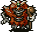

<table class="monsterPageTable">
  <tr>
    <th>Lv</th>
    <th>Name</th>
    <th>JP Name</th>
    <th>HP</th>
    <th>EXP</th>
    <th>ATK</th>
    <th>DEF</th>
    <th>Type</th>
    <th>Notes</th>
  </tr>
  <tr>
    <td>1</td>
    <td>Skeleton Mage</td>
    <td>ガイコツまどう</td>
    <td>23</td>
    <td>15</td>
    <td>14</td>
    <td>11</td>
    <td rowspan="3">Ghost</td>
    <td>Casts spells: Speed up, Teleport, Knockback, Swap</td>
  </tr>
  <tr>
    <td>2</td>
    <td>Skeleton Wizard</td>
    <td>ガイコツまじん</td>
    <td>39</td>
    <td>70</td>
    <td>27</td>
    <td>19</td>
    <td>Casts spells: Confusion, Buy Time, Paralysis, Damage</td>
  </tr>
  <tr>
    <td>3</td>
    <td>Skeleton Archmage</td>
    <td>ガイコツまおう</td>
    <td>60</td>
    <td>400</td>
    <td>55</td>
    <td>21</td>
    <td>Casts spells: Substitute, Seal, Unlucky, Sleep, Slow, Bufoo</td>
  </tr>
</table>

### Soldier Ant

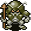

<table class="monsterPageTable">
  <tr>
    <th>Lv</th>
    <th>Name</th>
    <th>JP Name</th>
    <th>HP</th>
    <th>EXP</th>
    <th>ATK</th>
    <th>DEF</th>
    <th>Type</th>
    <th>Notes</th>
  </tr>
  <tr>
    <td>1</td>
    <td>Soldier Ant</td>
    <td>兵隊アリ</td>
    <td>18</td>
    <td>10</td>
    <td>23</td>
    <td>12</td>
    <td rowspan="3">None</td>
    <td rowspan="3">Wanders around and digs through walls</td>
  </tr>
  <tr>
    <td>2</td>
    <td>Ant Captain</td>
    <td>隊長アリ</td>
    <td>45</td>
    <td>50</td>
    <td>39</td>
    <td>18</td>
  </tr>
  <tr>
    <td>3</td>
    <td>General Ant</td>
    <td>大将アリ</td>
    <td>60</td>
    <td>100</td>
    <td>66</td>
    <td>24</td>
  </tr>
</table>

### Spinning Polygon

<table class="monsterPageTable">
  <tr>
    <th>Lv</th>
    <th>Name</th>
    <th>JP Name</th>
    <th>HP</th>
    <th>EXP</th>
    <th>ATK</th>
    <th>DEF</th>
    <th>Type</th>
    <th>Notes</th>
  </tr>
  <tr>
    <td>1</td>
    <td>Spinning Polygon</td>
    <td>まわるポリゴン</td>
    <td>20</td>
    <td>5</td>
    <td>13</td>
    <td>8</td>
    <td rowspan="3">Drain</td>
    <td>Teleports in front of Shiren. Reduces satiation by 10%</td>
  </tr>
  <tr>
    <td>2</td>
    <td>Dancing Polygon</td>
    <td>おどるポリゴン</td>
    <td>80</td>
    <td>400</td>
    <td>29</td>
    <td>15</td>
    <td>Teleports in front of Shiren. Reduces satiation by 30%</td>
  </tr>
  <tr>
    <td>3</td>
    <td>Singing Polygon</td>
    <td>うたうポリゴン</td>
    <td>80</td>
    <td>1200</td>
    <td>208</td>
    <td>25</td>
    <td>Teleports in front of Shiren. Reduces max satiation by 10%</td>
  </tr>
</table>

### Tauros

<table class="monsterPageTable">
  <tr>
    <th>Lv</th>
    <th>Name</th>
    <th>JP Name</th>
    <th>HP</th>
    <th>EXP</th>
    <th>ATK</th>
    <th>DEF</th>
    <th>Type</th>
    <th>Notes</th>
  </tr>
  <tr>
    <td>1</td>
    <td>Tauros</td>
    <td>タウロス</td>
    <td>12</td>
    <td>15</td>
    <td>9</td>
    <td>18</td>
    <td rowspan="3">None</td>
    <td rowspan="3">Chance to Crit</td>
  </tr>
  <tr>
    <td>2</td>
    <td>Minotaur</td>
    <td>ミノタウロス</td>
    <td>45</td>
    <td>300</td>
    <td>42</td>
    <td>18</td>
  </tr>
  <tr>
    <td>3</td>
    <td>Megatauros</td>
    <td>メガタウロス</td>
    <td>100</td>
    <td>1200</td>
    <td>255</td>
    <td>28</td>
  </tr>
</table>

### Theftodo

<table class="monsterPageTable">
  <tr>
    <th>Lv</th>
    <th>Name</th>
    <th>JP Name</th>
    <th>HP</th>
    <th>EXP</th>
    <th>ATK</th>
    <th>DEF</th>
    <th>Type</th>
    <th>Notes</th>
  </tr>
  <tr>
    <td>1</td>
    <td>Theftodo</td>
    <td>ぬすっトド</td>
    <td>35</td>
    <td>20</td>
    <td>0</td>
    <td>6</td>
    <td rowspan="3">None</td>
    <td>Steals items and teleports away. Always drops item.</td>
  </tr>
  <tr>
    <td>2</td>
    <td>Green todo</td>
    <td>みどりトド</td>
    <td>51</td>
    <td>50</td>
    <td>0</td>
    <td>12</td>
    <td rowspan="2">Same as above, and chance to split when damaged</td>
  </tr>
  <tr>
    <td>3</td>
    <td>Iron todo</td>
    <td>アイアントド</td>
    <td>70</td>
    <td>60</td>
    <td>0</td>
    <td>22</td>
  </tr>
</table>

### Wood Armor

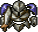

<table class="monsterPageTable">
  <tr>
    <th>Lv</th>
    <th>Name</th>
    <th>JP Name</th>
    <th>HP</th>
    <th>EXP</th>
    <th>ATK</th>
    <th>DEF</th>
    <th>Type</th>
    <th>Notes</th>
  </tr>
  <tr>
    <td>1</td>
    <td>Wood Armor</td>
    <td>セルアーマー</td>
    <td>20</td>
    <td>30</td>
    <td>21</td>
    <td>16</td>
    <td rowspan="3">Ghost</td>
    <td>Sends Shiren's equipped shield flying</td>
  </tr>
  <tr>
    <td>2</td>
    <td>Chrome Armor</td>
    <td>クロムアーマー</td>
    <td>65</td>
    <td>650</td>
    <td>48</td>
    <td>20</td>
    <td>Sends Shiren's equipped shield, or weapon flying</td>
  </tr>
  <tr>
    <td>3</td>
    <td>Chitin Armor</td>
    <td>チタンアーマー</td>
    <td>80</td>
    <td>1200</td>
    <td>255</td>
    <td>30</td>
    <td>Sends Shiren's equipped shield, weapon, or bracer flying</td>
  </tr>
</table>

### Wriggling Honey

<table class="monsterPageTable">
  <tr>
    <th>Lv</th>
    <th>Name</th>
    <th>JP Name</th>
    <th>HP</th>
    <th>EXP</th>
    <th>ATK</th>
    <th>DEF</th>
    <th>Type</th>
    <th>Notes</th>
  </tr>
  <tr>
    <td>1</td>
    <td>Wriggling Honey</td>
    <td>くねくねハニー</td>
    <td>30</td>
    <td>40</td>
    <td>24</td>
    <td>15</td>
    <td>Drain</td>
    <td>Reduces Shiren's level by 1</td>
  </tr>
</table>

### Mashoku Bug

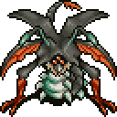

<table class="monsterPageTable">
  <tr>
    <th>Lv</th>
    <th>Name</th>
    <th>JP Name</th>
    <th>HP</th>
    <th>EXP</th>
    <th>ATK</th>
    <th>DEF</th>
    <th>Type</th>
    <th>Notes</th>
  </tr>
  <tr>
    <td>1</td>
    <td>Mashoku Bug</td>
    <td>魔蝕虫</td>
    <td>250</td>
    <td>9999</td>
    <td>150</td>
    <td>26</td>
    <td rowspan="3">None</td>
    <td></td>
  </tr>
</table>
